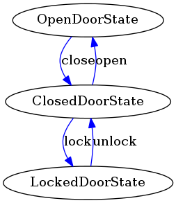

#State Updated

This is a State machine generator based on the work of Sebastian Bergmann (thank you Sebastian).

The intent of the [State](http://c2.com/cgi/wiki?StatePattern) design pattern is
to "allow an object to alter its behavior when its internal state changes. The
object will appear to change its class". The State pattern can be used, for
instance, to implement a [Finite State Machine](https://en.wikipedia.org/wiki/Finite-state_machine)
efficiently and elegantly. This approach can be useful when implementing
business processes or workflows.

This version differs from the original in the following ways:

- You can regenerate your state machines whenever you like without losing your code (See below for how to do this).
- You can now generate multiple state machines at once by using different .xml files. You can configure the output directory in the configuration files.

- It favours convention over configuration so some of the configuration file options have been removed.

- The generated classes are now namespaced so you can use your PSR autoloaders. 

- The state classes it generates have two additional methods onEnterState and onExitState. These are called automatically when the state machine enters or leaves a state. I'm guessing you worked that out for yourself though ;-)

- The state machine passes a pointer to the main state machine instance along to each state as the state is instantiated. This means a state can modify the state machines state. 
$this->SM->{operation function name}(); e.g. $this->SM->close() from the Door example.

-  The visualizer now bases its output on the configuration file for the state machine rather than trying to generate this from the code.

- The visualizer now tags the state transistion arrows with the name of the state change operation.

- The tests that are generated might be broken, I haven’t got around to testing them yet. 

- Examples Updated - In the examples folder you will find the Door example from Sebastian generated with the new code. There is also a bigger real world example of a state machine I created using this code to to with handling phone calls. The real code has been removed here, but the main structure of the statemachine is there for you to take a look at. You can see how crazy the diagrams generated can get when the statemachines get bigger.    


## Making sure your code doesn’t get overwritten
When you modify one of the functions generated by the generator be sure to move the code between the
```php
//###START_CUSTOMCODE2
```
and 
```php
//###END_CUSTOMCODE2
```
comments. For an example please see onEnterState ([source](examples/statemachines/PwrCall/StartUpState.php)) function in the StartUpState.php file in the PwrCall example folder.

## Implementing the generator to work with your existing code

You need to create one or more XML file to represent your state machine(s). The full XML state machine configuration is covered below. Importantly you should set the target directory *targetdir* where the statemachines are to be generated. This is a path relative to where you run the generator from. Also you should set the *namespace* that the statemachine classes will use.
```xml
 <configuration>
  <targetdir name="statemachines"/>
  <namespace name="djsharman\examples\statemachines"/>
 </configuration>
 ```
 You should then create a shell script (or batch file) to call the generator and, optionally, the visualizer.
 ```
php "..\generator\run.php" _defs
php "..\generator\runViz.php" _defs
 ```
The generator and visualiser take a single parameter which is the directory containing the state machine XML definition(s).

## Example: Door

Consider a class `Door` that represents a door. A door can be in one of three
states: open, closed, locked. When a `Door` object receives messages (such as
`open()`, `close()`, `lock()`, or `unlock()`) from other objects, it responds
differently depending on its current state. For example, the effect of an
`open()` message depends on whether the door is in its closed state or not (a
locked door has to be unlocked before it can be opened, for instance). The State
pattern describes how a `Door` object can exhibit different behavior in each
state. The key idea in this pattern is to introduce classes to represent the
states of the door.

### DoorState

The `DoorState` interface ([source](examples/statemachines/Door/DoorState.php)) declares an
interface common to all classes that represent different states.

```php
<?php
interface DoorState
{
    public function open();
    public function close();
    public function lock();
    public function unlock();
}
```

### AbstractDoorState

The `AbstractDoorState` class ([source](examples/statemachines/Door/AbstractDoorState.php))
implements the operations required by the `DoorState` interface in such a way
that all methods raise an `IllegalStateTransitionException` by default.

```php
<?php
abstract class AbstractDoorState implements DoorState
{
    public function open()
    {
        throw new IllegalStateTransitionException;
    }

    public function close()
    {
        throw new IllegalStateTransitionException;
    }

    public function lock()
    {
        throw new IllegalStateTransitionException;
    }

    public function unlock()
    {
        throw new IllegalStateTransitionException;
    }
}
```

### OpenDoorState, ClosedDoorState, and LockedDoorState

`OpenDoorState` ([source](examples/statemachines/Door/OpenDoorState.php)),
`ClosedDoorState` ([source](examples/statemachines/Door/ClosedDoorState.php)),
and `LockedDoorState` ([source](examples/statemachines/Door/LockedDoorState.php)) are child
classes of `AbstractDoorState` that overwrite the `open()`, `close()`, `lock()`,
and `unlock()` methods appropriately to return the object that represents the
new state. `OpenDoorState::close()` returns an instance of `ClosedDoorState`,
for instance:

```php
<?php
class OpenDoorState extends AbstractDoorState
{
    public function close()
    {
        return new ClosedDoorState;
    }
}
```

### Door

The `Door` class ([source](examples/statemachines/Door/Door.php)) maintains a state object (an
instance of a subclass of `AbstractDoorState`) that represents the current
state of the door:

```php
<?php
class Door
{
    private $state;

    public function __construct(DoorState $state)
    {
        $this->setState($state);
    }

    public function open()
    {
        $this->setState($this->state->open());
    }

    public function close()
    {
        $this->setState($this->state->close());
    }

    public function lock()
    {
        $this->setState($this->state->lock());
    }

    public function unlock()
    {
        $this->setState($this->state->unlock());
    }

    private function setState(DoorState $state)
    {
        $this->state = $state;
    }
}
```

The `Door` class forwards all state-specific messages to this state object.
Whenever the door changes state, the `Door` object changes the state object it
uses.

### Usage Example

```php
<?php
require __DIR__ . '/src/autoload.php';

$door = new Door(new OpenDoorState);
var_dump($door->isOpen());

$door->close();
var_dump($door->isClosed());

$door->lock();
var_dump($door->isLocked());

$door->lock();
```

The example script above yields the output below:

    bool(true)
    bool(true)
    bool(true)

    Fatal error: Uncaught exception 'IllegalStateTransitionException' in AbstractDoorState.php:25
    Stack trace:
    #0 Door.php(35): AbstractDoorState->lock()
    #1 example.php(13): Door->lock()
    #2 {main}
      thrown in AbstractDoorState.php on line 25

## Generating the State Machine

Using a [code generator](generator/run.php), the code shown above can be
automatically generated from an XML specification such as the one shown below:

```xml
<?xml version="1.0" encoding="UTF-8"?>
<specification>
 <configuration>
  <targetdir name="statemachines"/>
  <namespace name="djsharman\examples\statemachines"/>
 </configuration>
 <states>
  <state name="OpenDoorState"/>
  <state name="ClosedDoorState"/>
  <state name="LockedDoorState"/>
 </states>
 <transitions>
  <transition from="ClosedDoorState" to="OpenDoorState"   operation="open"/>
  <transition from="OpenDoorState"   to="ClosedDoorState" operation="close"/>
  <transition from="ClosedDoorState" to="LockedDoorState" operation="lock"/>
  <transition from="LockedDoorState" to="ClosedDoorState" operation="unlock"/>
 </transitions>
</specification>
```

Some parts of the state machine configuration are assumed by convention. 
- The name of the statemachine is taken from the name of the XML configuration file
- State tests are always the a given state name prefixed by "is". e.g. the test for OpenDoorState will be isOpenDoorState();
- Operation names in tests are always prefixed "testCan" or "testCannot". e.g. for the OpenDoorTest testCannotOpen and testCanClose. 


## Visualizing the State Machine

A graphical visualization of the statemachine states and its transitions can be generated based on the state machine's XML specification.

The `runViz.php` ([source](generator/runViz.php)) generates representation of the state machine as a directed graph
in [Dot](http://graphviz.org) markup.




## Documenting the State Machine through Tests

Using PHPUnit's [TestDox](http://phpunit.de/manual/current/en/other-uses-for-tests.html#other-uses-for-tests.agile-documentation)
functionality we can automatically generate documentation for the state
machine based on its tests:

    OpenDoor
     [x] Can be closed
     [x] Cannot be opened
     [x] Cannot be locked
     [x] Cannot be unlocked

    ClosedDoor
     [x] Cannot be closed
     [x] Can be opened
     [x] Can be locked
     [x] Cannot be unlocked

    LockedDoor
     [x] Cannot be closed
     [x] Cannot be opened
     [x] Cannot be locked
     [x] Can be unlocked

This automatically generated checklist makes it clear which transitions are
allowed between the three states of the state machine.
